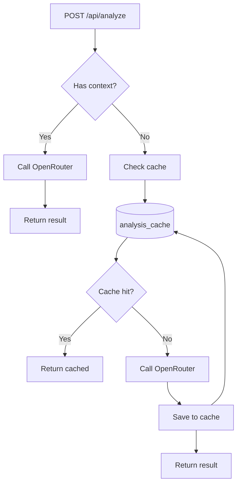

# Analysis Cache Implementation Plan

## Architektura



## 1. Migracja SQL

Nowy plik: `supabase/migrations/YYYYMMDDHHMMSS_create_analysis_cache.sql`

Tabela `analysis_cache`:

- `id` - UUID primary key
- `text_hash` - SHA256 hash znormalizowanego tekstu (TEXT, NOT NULL)
- `analysis_mode` - tryb analizy (TEXT, NOT NULL)
- `original_text` - oryginalny tekst dla debugowania (TEXT, NOT NULL)
- `result` - wynik analizy jako JSONB (TextAnalysisDto)
- `created_at` - data utworzenia
- `last_accessed_at` - data ostatniego dostępu (dla TTL)
- `hit_count` - licznik trafień

Constraint: `UNIQUE(text_hash, analysis_mode)`

RPC funkcje (SECURITY DEFINER, dostępne dla anon i authenticated):

- `get_cached_analysis(p_text_hash, p_mode)` - pobiera z cache, aktualizuje `hit_count` i `last_accessed_at`
- `set_cached_analysis(p_text_hash, p_mode, p_original_text, p_result)` - zapisuje do cache
- `cleanup_expired_cache()` - usuwa wpisy starsze niż 90 dni (do wywołania przez cron)

## 2. Serwis cache

Nowy plik: [src/lib/services/analysis/analysis-cache.service.ts](src/lib/services/analysis/analysis-cache.service.ts)

```typescript
export class AnalysisCacheService {
  constructor(private readonly supabase: SupabaseClient) {}

  async get(text: string, mode: AnalysisMode): Promise<TextAnalysisDto | null>;
  async set(text: string, mode: AnalysisMode, result: TextAnalysisDto): Promise<void>;

  private hashText(text: string): string; // SHA256
}
```

Hashowanie: użyć Web Crypto API (`crypto.subtle.digest`) dostępnego w Cloudflare Workers.

## 3. Modyfikacja AnalysisService

Plik: [src/lib/services/analysis/analysis.service.ts](src/lib/services/analysis/analysis.service.ts)

Zmiany:

- Konstruktor przyjmuje opcjonalny `SupabaseClient` (dla cache)
- Logika w `analyzeText()`:
  1. Jeśli `analysisContext` istnieje - pomiń cache
  2. Jeśli brak kontekstu - sprawdź cache przed wywołaniem AI
  3. Przy cache miss - zapisz wynik do cache po analizie

## 4. Modyfikacja API endpoint

Plik: [src/pages/api/analyze/index.ts](src/pages/api/analyze/index.ts)

Zmiana: przekazanie `locals.supabase` do `AnalysisService`.

## 5. Aktualizacja typów

Plik: [src/db/database.types.ts](src/db/database.types.ts)

Po migracji: wygenerować typy przez `npx supabase gen types typescript`.

## 6. Testy jednostkowe

Plik: [src/lib/services/analysis/analysis-cache.service.test.ts](src/lib/services/analysis/analysis-cache.service.test.ts)

Testy:

- Cache hit zwraca zapisany wynik
- Cache miss zwraca null
- Zapis do cache działa poprawnie
- Hashowanie jest deterministyczne

Aktualizacja: [src/lib/services/analysis/analysis.service.test.ts](src/lib/services/analysis/analysis.service.test.ts)

- Test: cache jest pomijany gdy jest kontekst
- Test: cache jest używany gdy brak kontekstu

## 7. Czyszczenie cache (cron)

Opcje:

- **Supabase pg_cron** (jeśli włączony) - `SELECT cron.schedule('cleanup-cache', '0 3 * * *', 'SELECT cleanup_expired_cache()')`
- **Cloudflare Cron Trigger** - endpoint `/api/admin/cleanup-cache` wywoływany przez cron

## Kluczowe decyzje

| Aspekt              | Decyzja                                                     |
| ------------------- | ----------------------------------------------------------- |
| Normalizacja tekstu | Tylko `trim()`, bez lowercase (wielkość liter ma znaczenie) |
| TTL                 | 90 dni od `last_accessed_at`                                |
| RLS                 | Wyłączone - cache jest globalny                             |
| Permissions         | RPC dostępne dla `anon` i `authenticated`                   |
| Hashowanie          | SHA256 przez Web Crypto API                                 |
